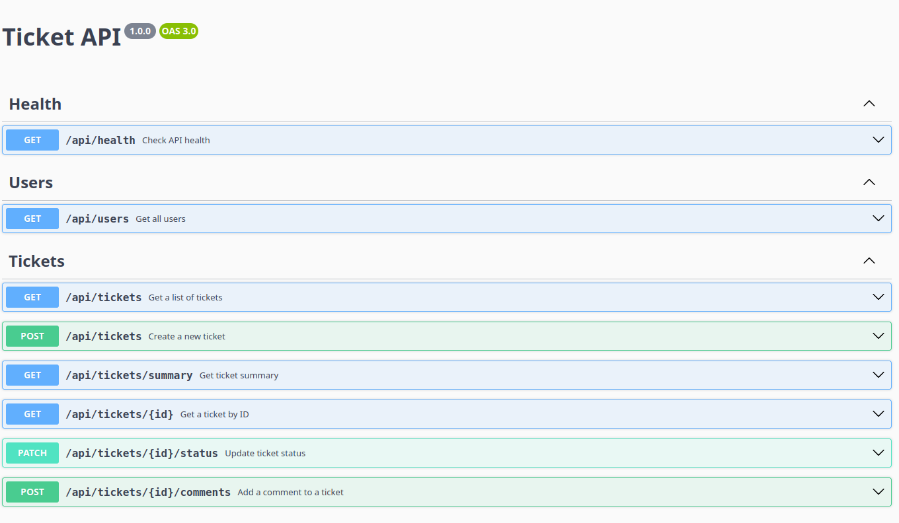

# Oxetech Helpdesk API

Esta e uma codebase-base para exercicios de refatoracao incremental. O projeto simula uma API simples de chamados de suporte academico.

O objetivo nao e reconstruir o sistema do zero. O objetivo e entender a aplicacao existente, identificar problemas tecnicos, fazer melhorias pequenas e justificar as decisoes por Pull Request.

## Requisitos

- Node.js 20 ou superior
- npm

## Tecnologias

- TypeScript
- Express
- Jest
- Swagger (OpenAPI)

## Funcionalidades

- Criar chamados
- Listar chamados
- Buscar chamado por ID
- Alterar status
- Adicionar comentários

## Como rodar

Instale as dependencias:

```bash
npm install
```

Reinicie os dados de exemplo, se necessario:

```bash
npm run seed
```

Execute em modo desenvolvimento:

```bash
npm run dev
```

A API ficara disponivel em `http://localhost:3000/api`.

## Documentação da API

Após iniciar o servidor, acesse:

```
http://localhost:3000/api-docs
```

A API possui documentação interativa gerada com Swagger e permite:

- visualizar todos os endpoints;
- testar requisições diretamente pelo navegador;
- consultar parâmetros, request bodies e respostas da API



## Arquitetura

O projeto está organizado nas seguintes camadas:

- **Routes:** definição das rotas da API.
- **Controllers:** tratamento das requisições HTTP.
- **Services:** implementação das regras de negócio.
- **Middleware:** validação das entradas da API.
- **Factory:** criação de objetos Ticket.
- **DatabaseManager:** acesso ao banco de dados em JSON.

## Scripts

- `npm run dev`: executa a API em modo desenvolvimento.
- `npm run seed`: recria o arquivo de dados inicial.
- `npm run typecheck`: valida os tipos TypeScript.
- `npm run build`: compila o projeto para `dist`.
- `npm test`: Executa os testes de integração implementados para validar os principais fluxos da API.

