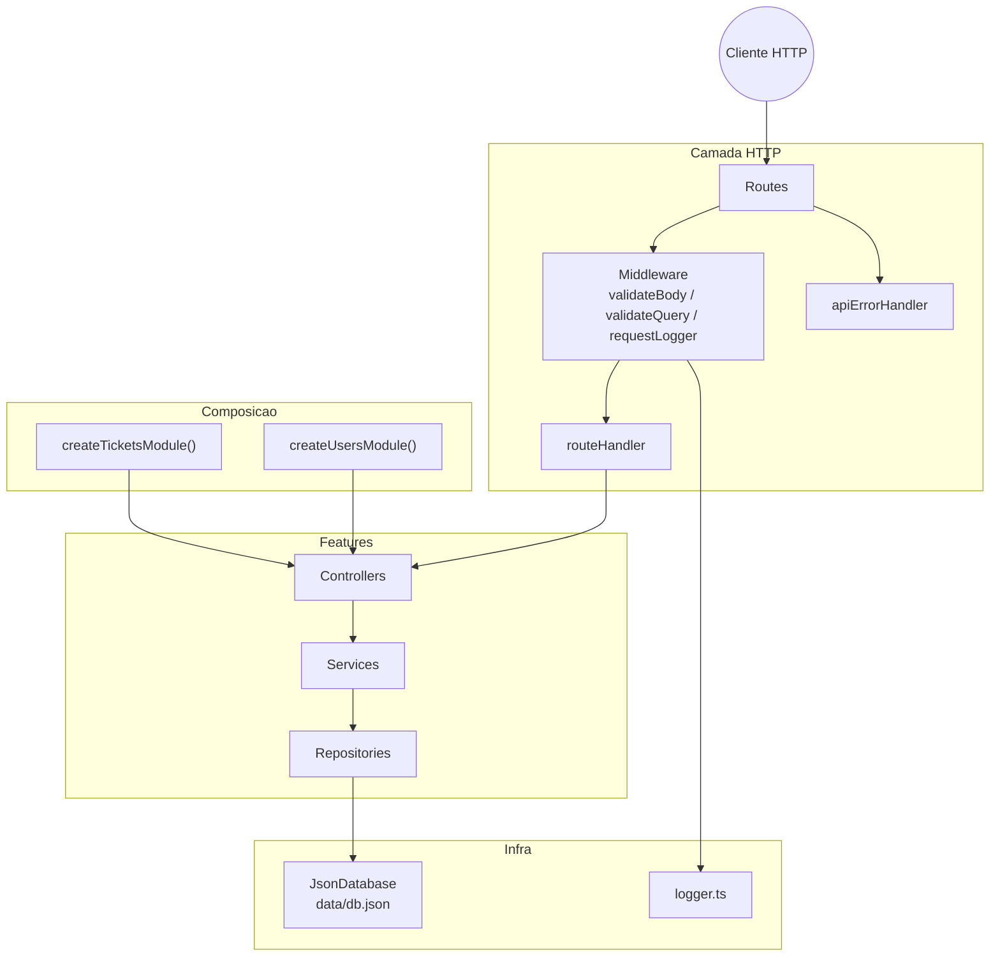
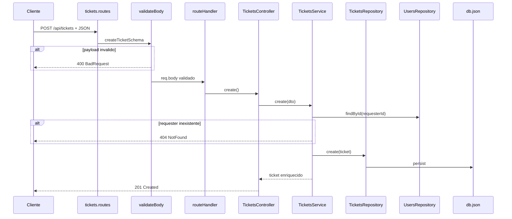

# Arquitetura — Avaliacao 2

Visao das camadas e fluxos principais da Oxetech Helpdesk API apos a Avaliacao 2.

---

## Camadas

---

## Fluxo POST /api/tickets

---

## Modulos e responsabilidades

| Pasta              | Responsabilidade                                 |
| ------------------ | ------------------------------------------------ |
| `src/routes/`      | Agregacao de routers por feature                 |
| `src/http/`        | Middleware, validacao, tratamento de erros       |
| `src/composition/` | Factories que montam controller + service + repo |
| `src/features/*/`  | Dominio por feature (health, tickets, users)     |
| `src/utils/`       | Logger, helpers transversais                     |
| `src/config/`      | Env e caminho do banco                           |

---

## Patterns aplicados

| Pattern         | Onde                                            |
| --------------- | ----------------------------------------------- |
| **Middleware**  | Validacao Zod, request logger, error handler    |
| **Factory**     | `createTicketsModule`, `createUsersModule`      |
| **Repository**  | Abstracao de persistencia JSON                  |
| **DTO publico** | `PublicUser` / `toPublicUser` na borda de saida |

---

## Referencias

- [Evolucao A2](EVOLUCAO-A2.md)
- [README](../README.md)
